# HireZone Feature Documentation & UML Diagrams

This document contains the details of the newly implemented features in HireZone, along with comprehensive UML diagrams (Use Case, Activity, and Sequence) for each core feature to help visualize the system architecture and workflows.

---

## 1. High-Level System Architecture

### High-Level Use Case Diagram
This diagram outlines the primary actors in the HireZone system and their overarching capabilities.

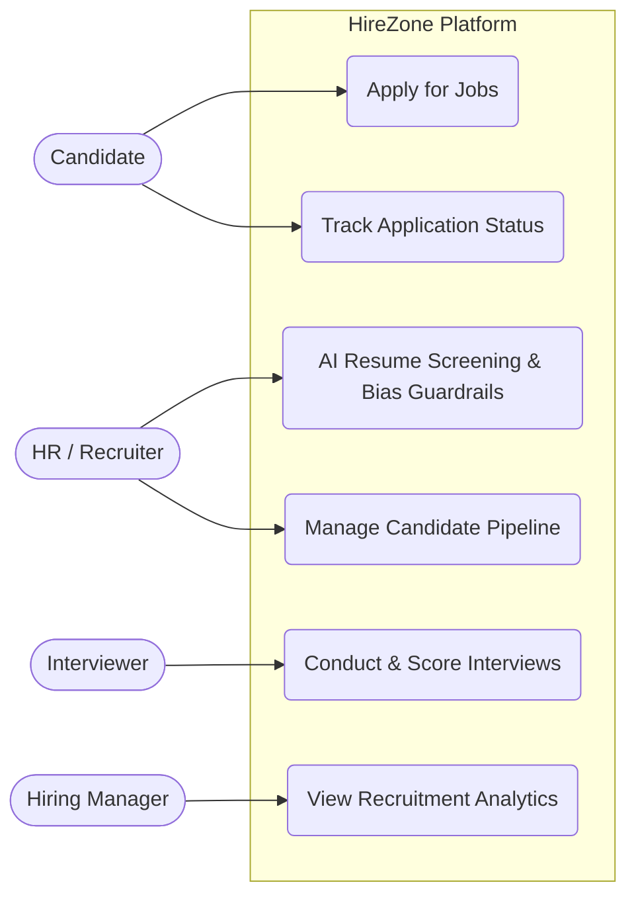

---

## 2. Feature 1: AI-Powered Resume Screening & Bias Guardrails

**Description**: Automates the initial screening of candidates by extracting information from uploaded PDF resumes. It leverages AI to evaluate candidates against job requirements while applying bias guardrails (e.g., hiding identifying information) to ensure fair hiring practices.

### 2.1 Use Case Diagram
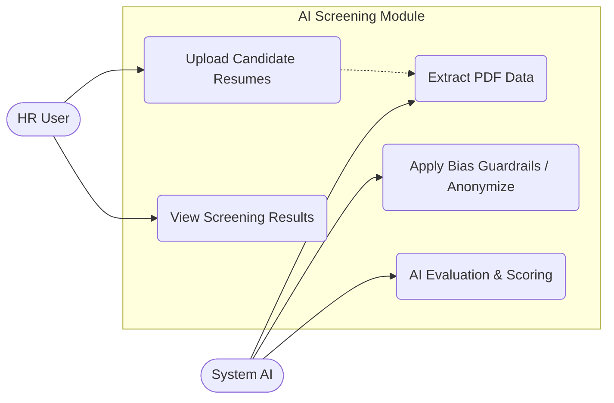

### 2.2 Activity Diagram
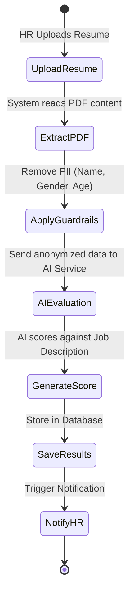

### 2.3 Sequence Diagram
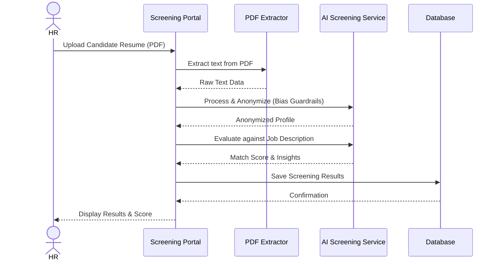

---

## 3. Feature 2: Job Applications & Careers Page

**Description**: A public-facing Careers page where candidates can browse open positions, view detailed job descriptions, and submit their applications directly into the HR pipeline.

### 3.1 Use Case Diagram
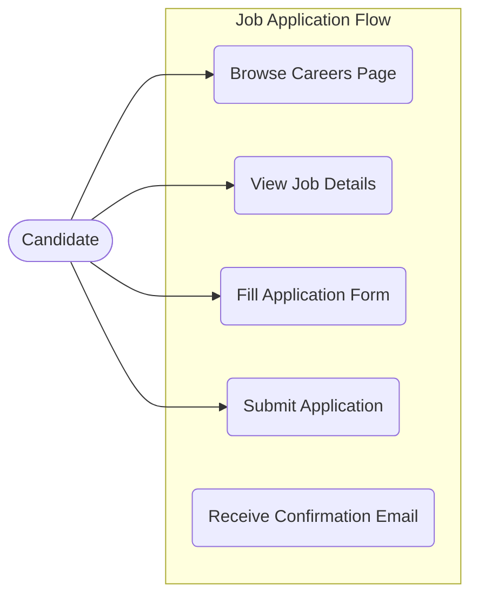

### 3.2 Activity Diagram
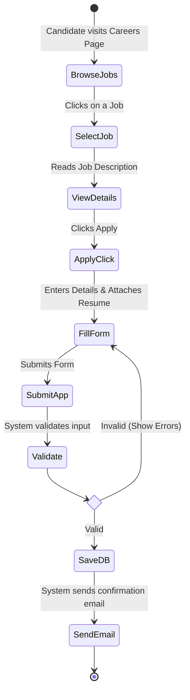

### 3.3 Sequence Diagram
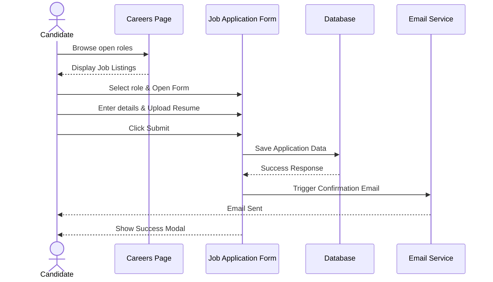

---

## 4. Feature 3: Role-Based Portals (HR, Candidate, Interviewer, Manager)

**Description**: Dedicated dashboards tailored to specific user roles. Includes HR Pipeline management, Candidate status tracking, Interviewer scoring forms, and Manager analytics.

### 4.1 Use Case Diagram
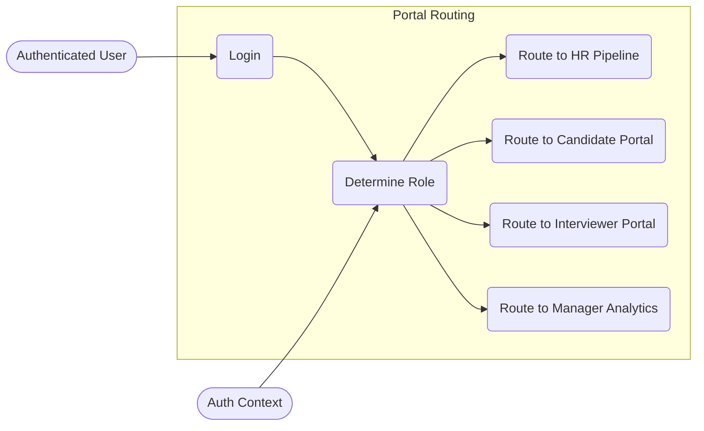

### 4.2 Activity Diagram
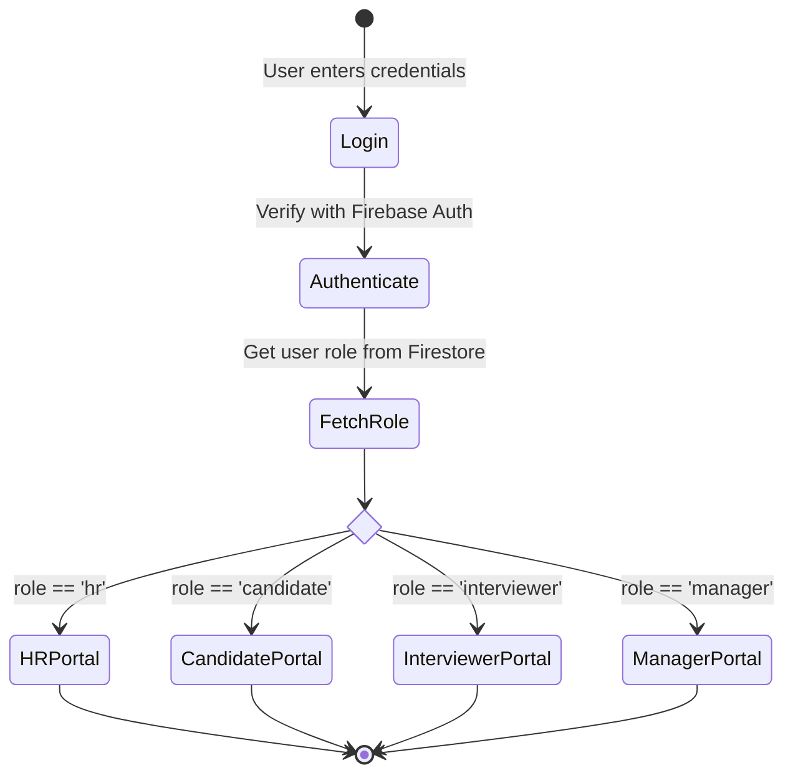

### 4.3 Sequence Diagram
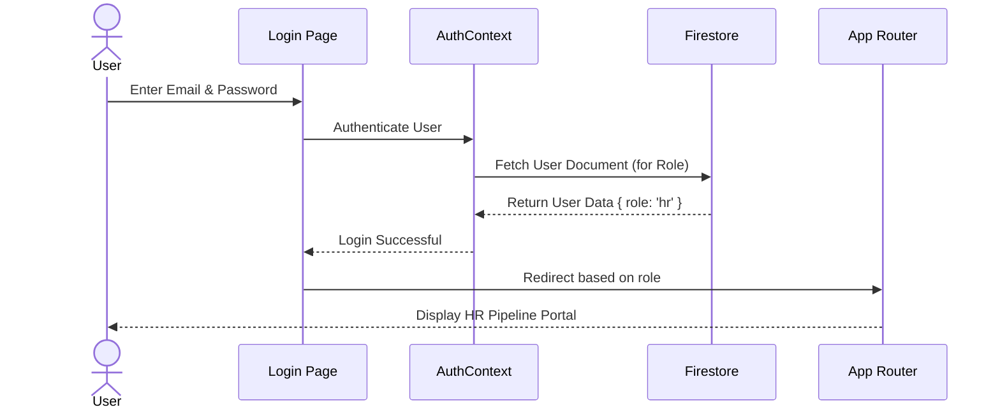

---

## 5. Feature 4: Real-time Notifications

**Description**: An in-app notification bell component that alerts users to important events like new applications, upcoming interviews, or completed AI screenings.

### 5.1 Use Case Diagram
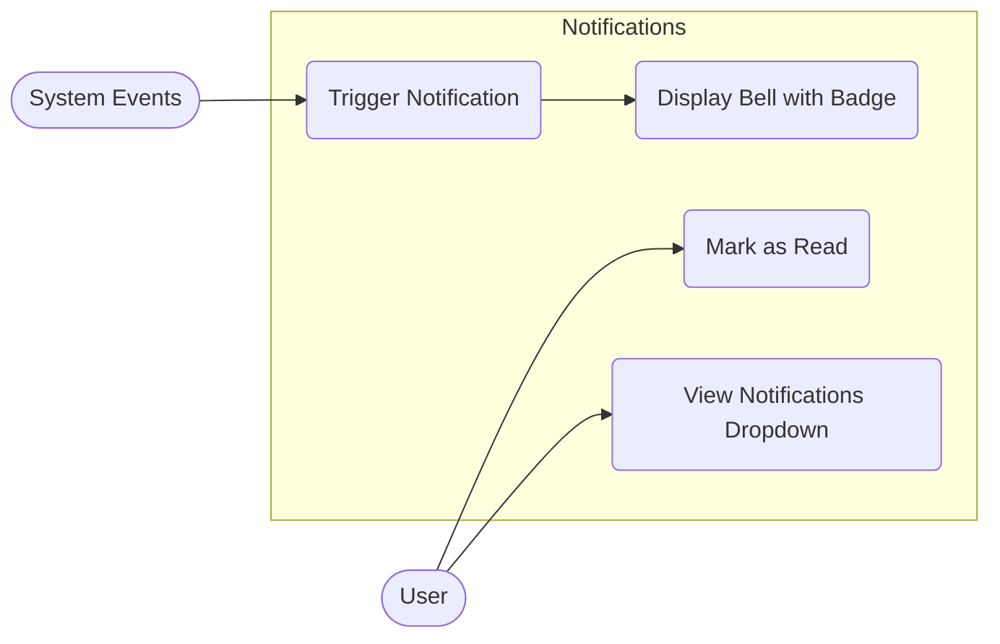

### 5.2 Activity Diagram
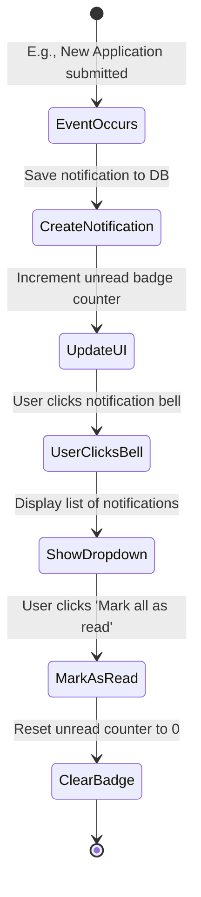

### 5.3 Sequence Diagram
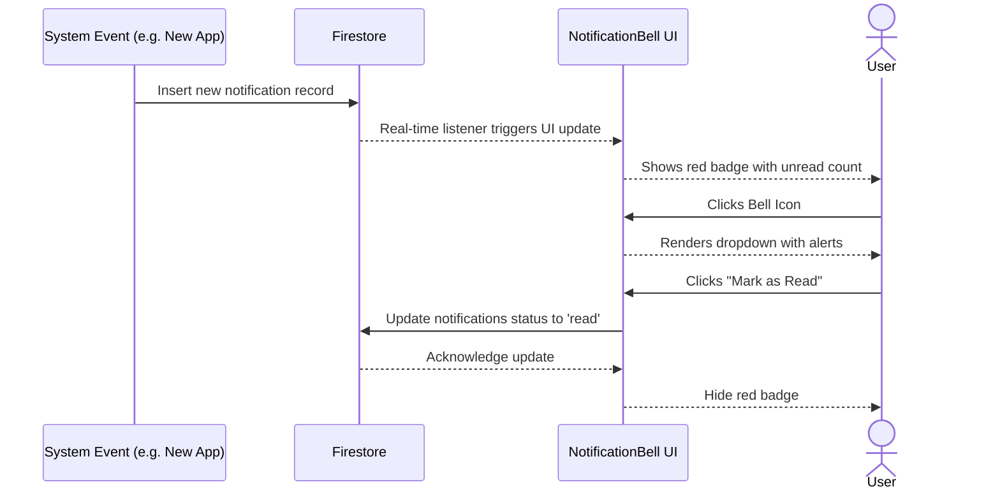
